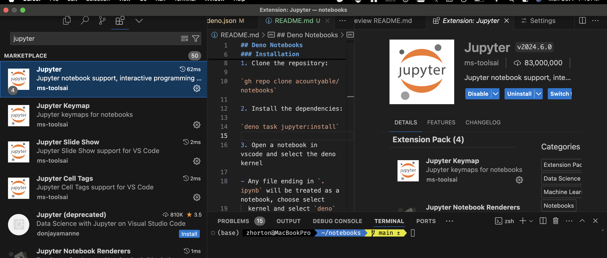
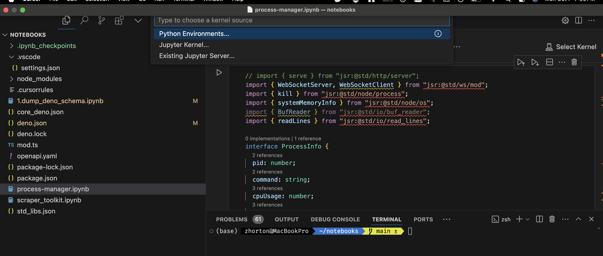
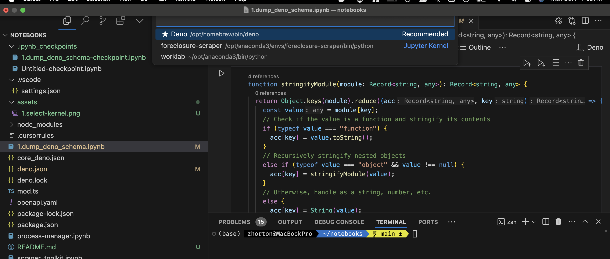

## Deno Notebooks

This repo contains a Deno project that allows you to run Jupyter notebooks using
Deno.

### Installation

1. Clone the repository:

`gh repo clone acountyable/notebooks`

2. Install Jupyter VSCode Extension

3. Install the deno jupyter kernel:

`deno task jupyter:install`

4. Open a notebook in vscode and select the deno kernel

- Any file ending in `.ipynb` will be treated as a notebook, choose select
  kernel and select `deno`

5. Bootup mock server for testing
   [OpenApi Specification](./storage/openapi.yaml) schema

`deno task mock:api`
